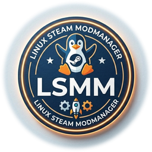

# Linux Steam ModManager (LSMM)

<p align="center">
  
</p>

A native Linux mod manager for Steam games with engine-plugin architecture.
Supports Bethesda games (Starfield, Skyrim SE, Fallout 4) out of the box, with a
plugin system designed to support other games (RimWorld, Witcher 3, etc.) in the future.

> ⚠️ **Early Alpha.** Core features work (Starfield tested). Expect rough edges. Not recommended for large mod setups yet.

> **Note:** This project was built with [Claude Code](https://claude.ai/code) by Anthropic.
> The code was generated through an AI-assisted development session and is maintained by the repository owner.

---

## Why?

Mod managers on Linux are an afterthought. Mod Organizer 2 and Vortex run via Wine/Proton
but aren't native tools. Linux gaming is growing — the Steam Hardware Survey shows a steady
increase, and the Steam Deck has brought thousands of new Linux users. This project aims to
fill that gap with a proper native tool.

---

## Features

- Install mods from `.zip`, `.7z`, and `.rar` archives
- **NXM URL import** *(experimental)* — paste an `nxm://` link from Nexus Mods for direct download + install (requires free Nexus API key)
- **Update check** — "Check Updates" button queries Nexus Mods API for newer versions of installed mods (NXM-imported only; requires API key)
- **Progress bar** — install and download operations show a progress bar; NXM downloads display real percentage, file installs use pulse mode
- **Games panel** — dedicated left column lists all game profiles; click to switch game, import external profiles via "Add", remove profiles via "Remove"
- **Mod profiles** — save and restore named loadouts (active mods + load order) per game
- Automatically detects mod structure and copies files to the correct location
- Handles standard `Data/`, double-nested `Data/Data/`, single-wrapper `ModName/Data/`, and bare-root layouts
- Manages `Plugins.txt` load order for Bethesda games
- Enable / disable individual mods
- Reorder load order via drag & drop in the GUI
- **Archive cache:** each mod archive is copied to `~/.local/share/linux-mod-manager/archives/{game}/` on install — the original can be moved or deleted without affecting the tracked state
- **Backup before overwrite:** if a mod install would overwrite an existing file (vanilla or from another mod), the original is backed up to `~/.local/share/linux-mod-manager/backups/{game}/{mod}/` and restored automatically on uninstall
- Tracks installed files for clean uninstall (no leftover files)
- **Linux case-sensitivity fix:** normalizes directory names (`interface/` → `Interface/`, `sfse/plugins/` → `SFSE/Plugins/`) that Windows-packed mods get wrong
- Script extender launch setup (SFSE, SKSE, F4SE) via Proton wrapper
- Multi-game support via JSON game profiles

---

## Requirements

- Python 3.10+
- GTK 4 + libadwaita (for the GUI): `sudo apt install python3-gi gir1.2-gtk-4.0 gir1.2-adw-1`
- `p7zip-full` — for `.7z` archives: `sudo apt install p7zip-full`
- `unrar` — for `.rar` archives: `sudo apt install unrar`
- `.zip` archives are handled by Python's standard library (no extra tool needed)
- Steam with Proton (for Bethesda games)

---

## Installation

```bash
git clone https://github.com/pyromeister/Linux-Steam-ModManager
cd Linux-Steam-ModManager
```

No pip dependencies — standard library only (GUI requires system GTK4 packages, see Requirements).

---

## Usage — GUI

```bash
python3 modlauncher-gui.py
```

Select your game from the dropdown. The load order panel appears automatically
for games that support it (Bethesda games). Use **+ Install** to open a file
chooser — you can select multiple archives at once and they will be installed
sequentially.

---

## Usage — CLI

```bash
python3 modlauncher.py --game starfield list
python3 modlauncher.py --game starfield install ~/Downloads/SomeMod.zip
python3 modlauncher.py --game starfield uninstall MyModName
python3 modlauncher.py games
```

Full command reference: [CLI Reference](https://github.com/pyromeister/Linux-Steam-ModManager/wiki/CLI-Reference)

---

## Supported Games

Starfield, Skyrim SE, The Planet Crafter — more planned.

Full list with engine and script extender details: [Supported Games](https://github.com/pyromeister/Linux-Steam-ModManager/wiki/Supported-Games)

Want a game added? [Open a Game Request](https://github.com/pyromeister/Linux-Steam-ModManager/issues/new?template=game_request.yml)

---

## Contributing

Contributions welcome — especially engine plugins for new games.
Open an issue before starting large changes.

Wiki for contributors: [Project Structure](https://github.com/pyromeister/Linux-Steam-ModManager/wiki/Project-Structure) · [Adding a New Game](https://github.com/pyromeister/Linux-Steam-ModManager/wiki/Adding-a-New-Game) · [Bethesda Engine Internals](https://github.com/pyromeister/Linux-Steam-ModManager/wiki/Bethesda-Engine-Internals)

---

## License

GPLv3 — free to use, modify, and distribute; any derivative work must remain open source under the same license. See [LICENSE](LICENSE) for details.
